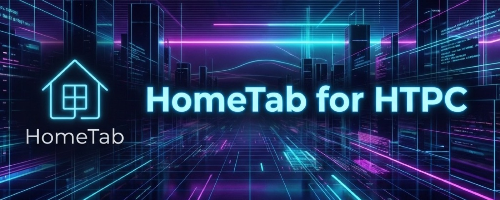
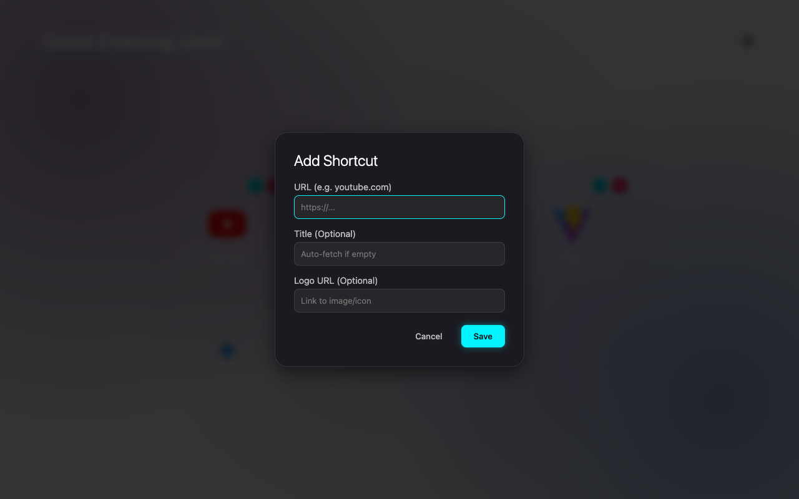

# HomeTab Launcher 📺



A modern, TV-style New Tab page designed for HTPCs, big screens, and keyboard warriors. Built with **TypeScript**, **Vite**, and **Glassmorphism** aesthetics.

## ✨ Features

- **🎮 TV-Optimized Navigation**: Full D-Pad (Arrow Keys) support. Navigate your grid without a mouse.
- **🎨 Modern Design**: Hybrid "Neon Cyberpunk" glow effects with clean Glassmorphism tiles.
- **✏️ Edit Mode & Customization**: 
  - **Full Control**: Add, Edit, and Remove shortcuts.
  - **Auto-Fetch**: Automatically grabs website titles and icons.
  - **Custom Logos**: Support for manual image URLs.
  - **Personal Greeting**: Click the "Good Evening" text to type your own welcome message.
- **📱 PWA Support**: Installable as a standalone app.
- **🔒 Privacy Focused**: No tracking. All data is stored locally.

## 📥 Download

[**Download Latest Release (v1.2)**](https://github.com/alidkhaida/hometab/releases)

## 📸 Gallery

| Main Grid | Edit Mode |
|-----------|-----------|
|  |  |

| Add Shortcut | Custom Greeting |
|--------------|-----------------|
|  |  |

## 🚀 Installation

### 1. As a Chrome/Edge Extension (Developer Mode)
1. Download the `hometab-extension.zip` from Releases (or clone this repo).
2. Unzip it (if downloaded).
3. Open your browser's Extensions page:
   - Chrome: `chrome://extensions`
   - Edge: `edge://extensions`
4. Enable **Developer Mode**.
5. Click **Load unpacked** and select the folder (or `dist` if building from source).

### 2. As a Firefox Extension
1. Load `manifest.firefox.json` via `about:debugging`.

### 3. As a PWA
1. Open the hosted page (or localhost).
2. Click the "Install App" icon in the address bar.

## �️ Privacy Policy

This extension does not collect any user data. All shortcuts and preferences are stored locally on your device.
[View Full Privacy Policy](https://alidkhaida.github.io/hometab/PRIVACY.md)

## 💻 Development

This project uses **Vite** and **TypeScript**.

```bash
# Install dependencies
npm install

# Start Dev Server (Hot Reload)
npm run dev

# Build for Production (outputs to /dist)
npm run build
```

## 📄 License
MIT
